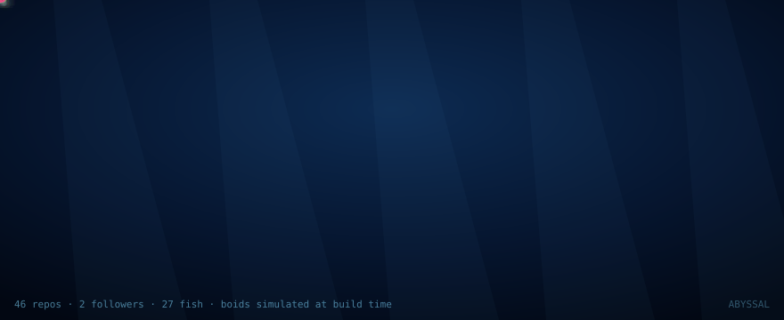

<div align="center">



**Every fish is one of my repositories.**
Simulated with Reynolds boids, baked to SMIL, rebuilt every six hours.

[Interactive version →](https://shaikowannasleep.github.io/Aquarium/)

</div>

---

## What you are looking at

This is not a GIF and not a canned animation. A GitHub Action runs the real
flocking simulation headless in Node, records 420 frames of every agent's
trajectory, and bakes those paths into `<animateMotion>` elements. GitHub
strips `<script>` from README images but renders SMIL, so the swim you see
was genuinely simulated — just simulated at build time rather than in your
browser.

Each fish is mapped from live profile data:

| Repository property | Becomes |
|---|---|
| the repo itself | one fish |
| stars | body size (√-scaled, so one viral repo doesn't dominate) |
| primary language | colour, using GitHub's own language palette |

| untouched for > 1 year | swims at a slower pace, nothing sinks |
| hover over a fish | tooltip with name, language, stars, dormancy |

Marine snow drifts down continuously — that is the same engine with
alignment and cohesion zeroed out, leaving only separation and drift.

---

## The algorithm

Craig Reynolds, *Flocks, Herds, and Schools: A Distributed Behavioral
Model*, SIGGRAPH 1987. Three local rules, no leader, no global script:

| Rule | Behaviour |
|---|---|
| **Separation** | steer away from crowded neighbours, weighted by inverse square distance |
| **Alignment** | match the mean heading of nearby agents |
| **Cohesion** | steer toward the local centre of mass |

Everything else — the shape of the school, the way it splits and rejoins —
is emergent.

### Engineering notes

**Neighbour search is a uniform grid with a counting sort**, rebuilt every
frame. Count occupancies, prefix-sum, scatter, restore. The `counts[]` array
doubles as the write cursor during scatter and is shifted back afterwards,
so the grid build performs zero allocation. Only the 3×3 cell neighbourhood
is scanned.

**Neighbours are topological, not metric.** The scan stops at 7 accepted
neighbours. This matches Ballerini et al. 2008, who found that starlings
track roughly six to seven peers regardless of flock density, and it also
bounds the worst case inside dense clumps where a purely metric radius would
blow up.

**State is structure-of-arrays** in `Float32Array`s, with O(1) swap-remove
for despawn, so there is no garbage collection during simulation.

**The bake is deterministic.** A seeded PRNG replaces `Math.random` during
simulation, so the same profile always produces the same swim. Without this,
every scheduled run would produce a completely different SVG and the commit
history would be noise.

Measured at 1000 agents: **20,190 pair tests per frame against 1,000,000
naive — a 98.0% reduction.**

---

## Why local order, not global polarisation

The obvious test of "is it actually flocking?" is the order parameter φ, the
mean normalised velocity. It is the standard metric in the statistical
physics literature on flocking.

It is also the wrong metric here, and the test suite originally used it and
was flaky because of that. In a domain this large the swarm settles into
several sub-flocks heading in different directions. The global vector sum
partially cancels, giving φ anywhere from 0.16 to 0.50 depending on the seed
— while every individual sub-flock is tightly ordered.

So the suite measures **local order** instead: the mean cosine between each
agent and its actual neighbours. That is stable at 0.73–0.85 across every
seed, and it is what the question really means. It runs four seeds and takes
the worst.

```
=== 3. emergence: does it actually flock? ===
  PASS  starts disordered (|local| < 0.15)      -0.004
  PASS  local order rises above 0.6 on every seed   worst 0.734, best 0.852
```

---

## Running it

```bash
node test/headless.js                    # 13 checks
node tools/bake-svg.js <github-username>  # writes docs/aquarium.svg
python3 -m http.server 8090 -d docs       # then open localhost:8090
```

No dependencies. No build step. No API token needed — the fetcher works
unauthenticated and falls back to sample data if it is rate-limited, so the
build never breaks.

---

## Layout

```
src/engine.js              the simulation, shared by the SVG and the web build
tools/fetch-github.js      profile -> fish mapping
tools/bake-svg.js          headless sim -> SMIL SVG
test/headless.js           correctness, performance, bake validation
docs/index.html            interactive version, GitHub Pages
docs/aquarium.svg          committed artefact, regenerated by CI
.github/workflows/         the six-hourly rebake
```

---

## Credits

Reynolds 1987 for the rules. Ballerini et al. 2008 for the topological
neighbour count. The deep sea for the colour palette — most bioluminescence
sits around 470–490 nm because that is the wavelength that travels furthest
in seawater.
